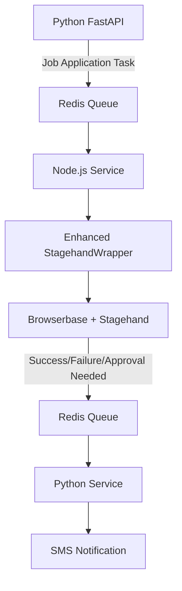

# Job Application Node.js Service

This service handles automated job applications using Stagehand's AI-powered browser automation. It features dynamic form processing, intelligent question answering, and multi-step application support.

## Features

### 🤖 Enhanced AI-Powered Automation
- **Dynamic Form Analysis**: Automatically detects and adapts to different application form layouts
- **Agentic Question Answering**: Uses AI to intelligently answer company-specific questions
- **Multi-Step Application Support**: Handles complex, multi-page application workflows
- **Smart Navigation**: Finds and clicks apply buttons across various job board layouts

### 🔄 Intelligent Processing Loop
- **Adaptive Form Processing**: Analyzes each form step and fills fields appropriately  
- **Context-Aware Responses**: Generates answers based on user profile and job context
- **Graceful Fallback**: Requests human approval when automation isn't possible
- **Session State Management**: Maintains state across form steps and page transitions

### 📋 Comprehensive Field Handling
- **Standard Fields**: Name, email, phone, address, social links
- **File Uploads**: Resume and cover letter handling (with manual fallback)
- **Custom Questions**: AI-powered responses to company-specific questions
- **Field Type Detection**: Supports text, select, radio, checkbox, date fields

## Architecture



## Enhanced Task Structure

### JobApplicationTask Interface
```typescript
interface JobApplicationTask {
    job_id: number;
    job_url: string;
    company: string;
    title: string;
    user_data: {
        // Basic info
        name: string;
        first_name?: string;
        last_name?: string;
        email: string;
        phone: string;
        
        // Documents
        resume_url?: string;
        cover_letter_url?: string;
        
        // Contact info
        linkedin_url?: string;
        github_url?: string;
        portfolio_url?: string;
        address?: string;
        city?: string;
        state?: string;
        zip_code?: string;
        
        // Profile data for intelligent responses
        experience_years?: number;
        skills?: string[];
        current_role?: string;
        education?: string;
        preferred_work_arrangement?: 'remote' | 'hybrid' | 'onsite';
        availability?: string;
        salary_expectation?: string;
    };
    credentials?: {
        username: string;
        password: string;
    };
    custom_answers?: Record<string, any>;
    application_id: number;
    ai_instructions?: {
        tone?: 'professional' | 'casual' | 'enthusiastic';
        focus_areas?: string[];
        avoid_topics?: string[];
    };
}
```

## How It Works

### 1. Dynamic Page Detection
```typescript
// Analyzes each page to determine:
// - Whether it's a job description or application form
// - If clicking "Apply" redirects to another page  
// - Multi-step form detection with progress tracking
const pageAnalysis = await page.extract({
    instruction: "Analyze this page to determine if it's a job description, application form, or something else...",
    schema: PageAnalysisSchema
});
```

### 2. Agentic Form Processing Loop
```typescript
while (currentStepAttempts < maxStepAttempts && maxSteps > 0) {
    // 1. Analyze current form state
    const formAnalysis = await page.extract({
        instruction: "Analyze the current application form...",
        schema: DynamicFormAnalysisSchema
    });
    
    // 2. Fill standard fields
    await this.fillStandardFields(formAnalysis.fields, task.user_data);
    
    // 3. Process custom questions with AI
    await this.processCustomQuestions(formAnalysis.customQuestions, task.user_data);
    
    // 4. Navigate to next step or submit
    const navResult = await this.proceedToNextStepOrSubmit(formAnalysis);
    
    if (navResult.completed) {
        return { success: true, confirmation_message: "..." };
    }
}
```

### 3. Smart Question Handling
```typescript
// For unknown questions, the system:
// 1. Analyzes the question context using AI
const questionAnalysis = await page.extract({
    instruction: `Analyze this question: "${question}". Consider the user's background: ${userData.current_role}, ${userData.experience_years} years experience...`,
    schema: QuestionAnalysisSchema
});

// 2. Attempts to generate appropriate responses
if (questionAnalysis.suggestedAnswer) {
    await page.act(`answer the question "${question}" with "${questionAnalysis.suggestedAnswer}"`);
}

// 3. Falls back to human approval when needed
if (questionAnalysis.needsHumanInput) {
    return { needsApproval: true, question: question };
}
```

## Environment Variables

```bash
# Browserbase Configuration
BROWSERBASE_API_KEY=your_browserbase_api_key
BROWSERBASE_PROJECT_ID=your_project_id
OPENAI_API_KEY=your_openai_api_key

# Redis Configuration
REDIS_URL=redis://localhost:6379

# Browser Configuration
STAGEHAND_HEADLESS=true
STAGEHAND_TIMEOUT=30000
BROWSER_VIEWPORT_WIDTH=1280
BROWSER_VIEWPORT_HEIGHT=720
BROWSER_USER_AGENT="Mozilla/5.0 (X11; Linux x86_64) AppleWebKit/537.36"

# Processing Configuration
MAX_RETRIES=3
```

## Setup & Development

### Installation
```bash
npm install
```

### Testing
```bash
# Run all tests
npm test

# Run specific test files
npm test -- src/stagehand-wrapper.test.ts
npm test -- src/application-processor.test.ts

# Run integration tests
npm test -- src/test/integration.test.ts
```

### Development
```bash
# Start in development mode with hot reload
npm run dev

# Build for production
npm run build

# Start production server
npm start
```

## Key Benefits

### 🚀 **Handles Variable Forms**
Adapts to different application layouts and field types across job boards

### 🧠 **Intelligent Responses** 
Uses AI to answer company-specific questions appropriately based on user profile

### 📈 **Multi-step Support**
Navigates through complex, multi-page applications automatically

### 🔄 **Graceful Fallback**
Requests human approval when automation isn't possible, with screenshots

### 📊 **Session Tracking**
Maintains state across form steps and page transitions

### ⚡ **Scalable Architecture**
Event-driven design with Redis queues for reliable task processing

## Monitoring & Health Checks

The service provides comprehensive monitoring:

```typescript
// Health check endpoint provides:
{
    status: 'healthy' | 'unhealthy',
    details: {
        redis: boolean,
        isProcessing: boolean,
        queueStats: { ... },
        maxRetries: number
    }
}
```

## Error Handling

- **Retry Logic**: Exponential backoff for transient failures
- **Dead Letter Queues**: Failed tasks are tracked and can be replayed
- **Screenshot Capture**: Automatic screenshots on failures for debugging
- **Structured Logging**: Comprehensive logging for monitoring and debugging

## Production Deployment

The service runs in Docker containers and can be deployed to:
- **Fly.io** (current production setup)
- **AWS ECS/Fargate**
- **Google Cloud Run**
- **Azure Container Instances**

The **Stagehand** library proves to be absolutely **perfect** for this use case because it combines the reliability of Playwright with AI-powered natural language understanding, making it ideal for handling the unpredictable nature of job application forms across different companies and platforms. 